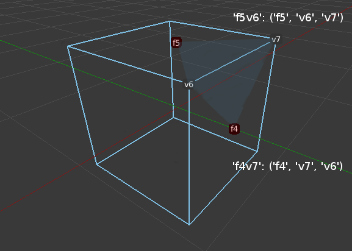
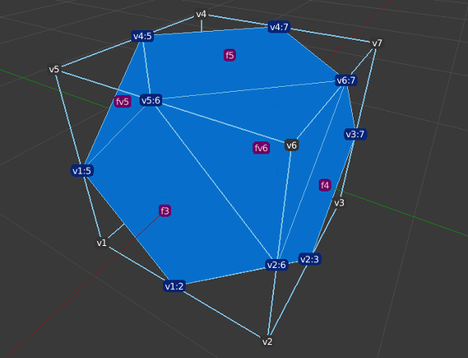

# Comments on the coding of *conway.py*

### Introduction

Conway Polyhedra are formed by applying various operators to a seed polyhedron such as one of the platonic solids.

These are some high level comments on the code in *conway.py* which implements the operators in python.

### Mesh Representation

The basic structure used to encode a mesh is the face-vertex representation. A vertex is represented by a list of three coordinates (x, y, z).  A mesh will have a list of vertices in no particular order.  The faces are a list of the index of the vertices in the face in counter-clockwise order. A mesh will haves a list of faces, again in no particular order. Each Conway operator has a list of vertices and a list of faces as input and output.

Internally the code uses what I've called a flag-tags representation. This is partly borrowed from [Levskaya's coffeescript code](https://github.com/levskaya/polyhedronisme/blob/master/topo_operators.coffee)  During the application of an operator to a mesh the vertices and faces of the mesh are created step by step. Each newly created face and vertex is given a string "tag" that uniquely identifies it. This is more versatile than referring directly to the index of a vertex in the vertices list as it allows you to refer to new vertices by their position in the mesh structure before they are created and before you know their index number.

The mesh is represented by a dictionary of "flags" or directed half edges of the mesh. A flag consists of a vertex, a face it belongs to and the next CCW vertex in that face. It is coded as a dictionary where the key is the face tag concatenated with the vertex tag. The value is a tuple (face tag, vert tag, tag of next CCW vert in the face). There will be two flags for every edge in the mesh.

The following image shows two flags and their associated tags for a cube. The whole cube will have 24 flags.



When new edges and vertices are created by an operator they are given tags based on the conventions below. Vertex tags always begin with "v" and face tags with "f". The following image shows the new tags created by an ambo operator on a cube. The vertex tags have a dark blue background and the face tags are pink.



At the end of the creation process the flag-tag structure is converted back to a face-vertex representation.

### Tag naming conventions

* vert at original vert with index 3 is tagged 'v3'
* vert at  centre of face with index 5 is tagged 'vf5'
* vert one third along edge between v3 and v4 is tagged 'v3:4'
* vert two thirds along edge between v3 and v4 is tagged 'v4:3'
* vert halfway along edge between v3 and v4 is tagged 'v3:4' never 'v4:3'
* face on original face 5 contained original vert 3 is tagged 'f5:3'
* face at centre of orginal face 5 is tagged 'f5'
* face centered on original vert 3 is tagged 'fv3'

### Iterating over edges

The *zip* function is used to iterate over every edge in a face. That is take each consecutive pair of vertices including the last vertex and the first vertex.

```
for face in faces:
  for v1, v2 in zip(face, face[1:] + face[:1]):
  ...
```
Iterating over each edge like this will cover each edge of the mesh twice, once in the order (v5, v6) and once in the order (v6, v5).

### Variable naming conventions

In the code it can be confusing whether the variable refers to the coordinates of a vertex or its index or its tag. A variable naming convention has been used to give light type casting.

for a vertex use the following variable names

* v3_xyz - coordinates (list of three floats)
* v3_i -  index (integer)
* v3 - also index
* v3_t - tag (string)
* v3_v - mathutils.Vector(v3_xyz)

for a face

* faces - list of a list of vertex indexes (list of lists of integers)
* face - list of vertex indexes (list of integers)
* face_i  - that face's index in faces (integer)
* face_t  - tag to name face (string)
* face_vt - list of vertex tags (list of strings)
